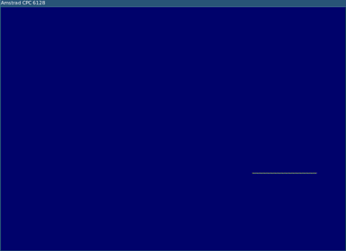

## zpz: An Amstrad CPC emulator frontend written in zig using https://github.com/floooh/chips

<p align="center">
  
</p>

`zpz` is an emulator frontend (basically just some zig glue code) that uses
`https://github.com/floooh/chips` to emulate an Amstrad CPC 6128.

I encourage you to check out https://github.com/floooh/chips for a very
well made, clean and understandable CPC emulator code base.

## Demo

The emulator is accessible in your browser here: http://cpc.novidee.com.

## Build

First clone the zpz repository:
```bash
git clone git@github.com:jdmichaud/zpz.git
```

Then, in `zpz` folder, initialize the chips submodule:
```bash
git submodule init
git submodule update
```
Note that this will checkout a custom version of the chip folder supporting 2
disks for the CPC.

Then to build the solution:
```bash
zig build
```

For best performance:
```bash
zig build -Drelease-fast
```

## Usage

To launch:
```bash
./zig-out/bin/zpz6128
```

To load one or two disks, pass the `dsk` file path in the command line:
```bash
./zig-out/bin/zpz6128 /path/to/some.dsk /another/path.dsk
```

## Build for the web

In order to generate a wasm file do:
```bash
zig build wasm -Drelease-safe=true
```

Then serve the web folder:
```bash
cd web
python3 -m http.server
```

The release flag is mandatory. Without it, your browser will complain of too
much local variables. The release flag optimizes away some of them.
